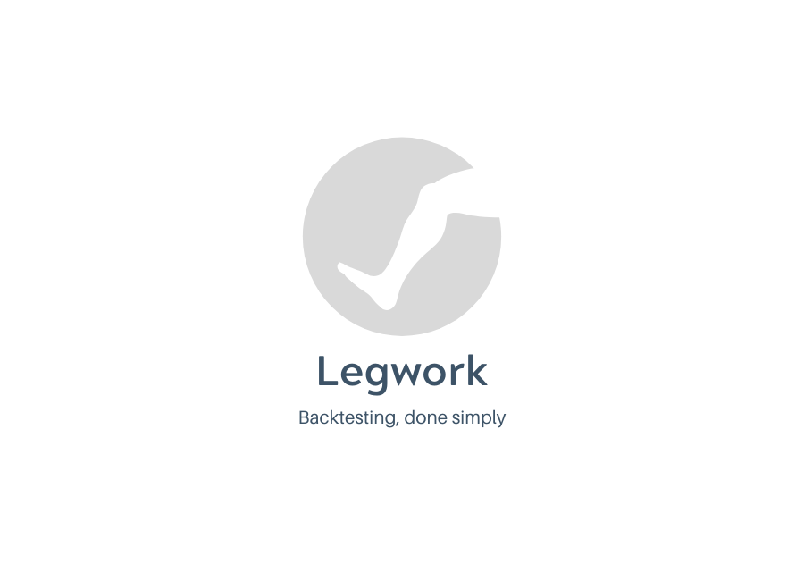

<div style="display:flex; justify-content:center;">

</div>

## Contributing [](https://github.com/dwyl/esta/issues) [](http://hits.dwyl.io/sebasslash/legwork)

An event driven backtesting engine written in C++ for algorithmic trading. You will be able to write algorithms in Python, which will be able to interface with the engine seamlessly.

### Setup
Make sure you have `docker` or `vagrant` installed.

#### Run with Docker
```bash
sh ./setup.sh
```

### Run with vagrant
```bash
blah blah
```

#### Example run configuration
```bash
python3 main.py --dir "Daily" --start-time "2016-12-15" --end-time "2018-12-17"
```

